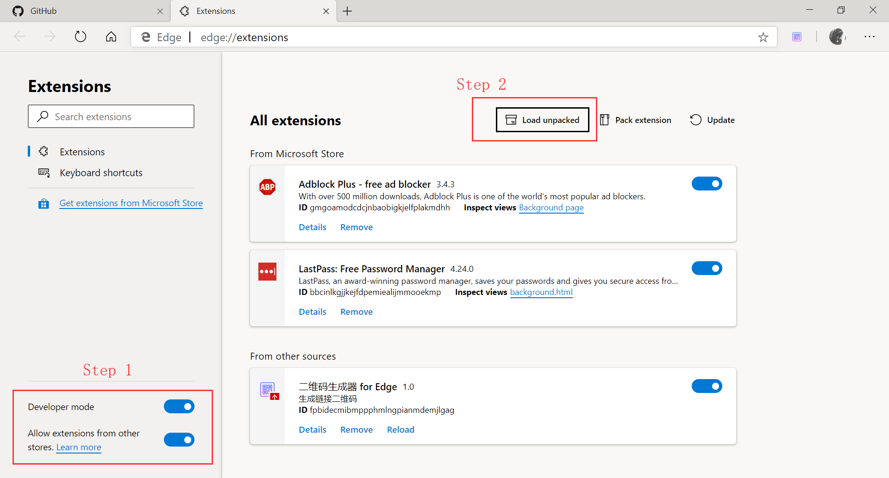

## 二维码生成插件 for Edge(Chromium)

理论支持 Chrome

### 效果预览

### 安装方法:

1. clone 此项目

2. 参考下图

Step 2 后选择项目文件夹

### Thanks

- [jQuery](https://jquery.com/)

- [jquery-qrcode](https://github.com/jeromeetienne/jquery-qrcode)